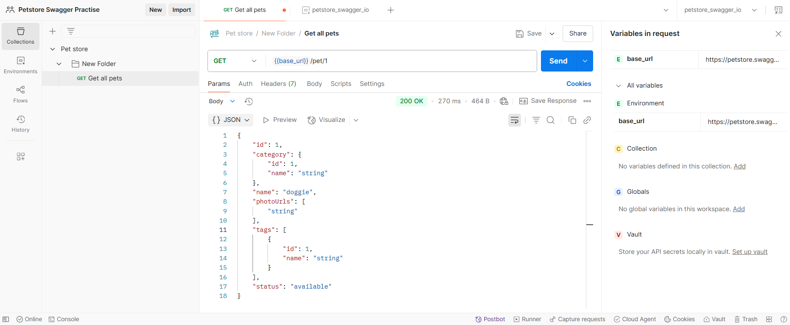
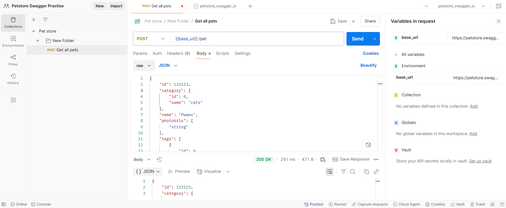
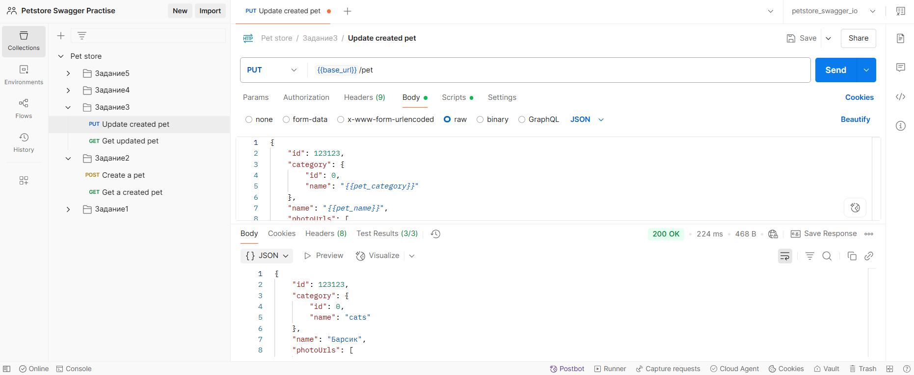
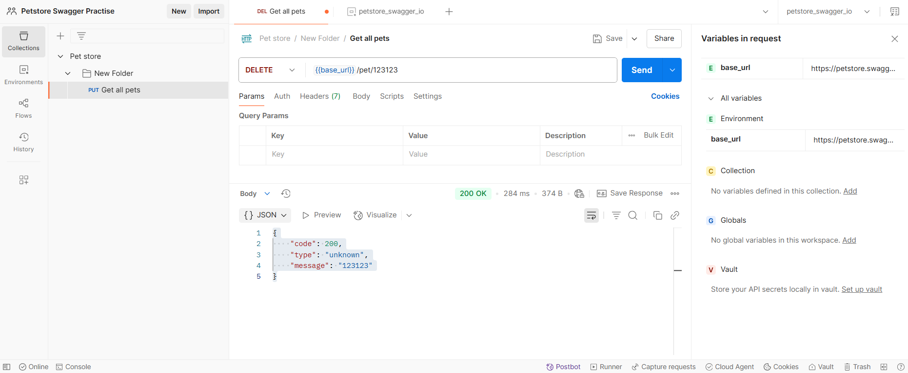
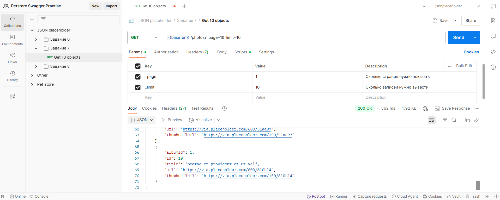
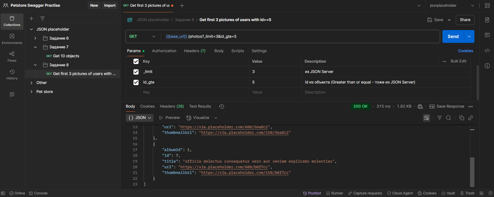

# Настройки

### Установить переменную `base_url`
Environment -> New -> Environment -> `petstore_swagger_io`

|Variable|Type|Initial value|Current value|
|-|-|-|-|
|`base_url`|default|https://petstore.swagger.io/v2|https://petstore.swagger.io/v2|


Установить Environment (под иконкой аккаунта).

### Написание тестов
Перейти в запрос -> Scripts (под строкой для запроса)

<br>

---
---

<br>

## Задания (petstore.swagger.io)

<br>

### Задание №1:
Отправьте `GET`-запрос на получение информации о конкретном питомце, используя ID существующего питомца. Например, отправьте запрос на `/pet/{id}`, заменив `{id}` на любой доступный идентификатор питомца из примеров документаций.

```
{{base_url}}/pet/1
```



---

### Задание №2:
Создайте нового питомца с именем «Рыжик», породой «Кошка». Отправьте POST-запрос с нужным телом JSON. Убедитесь, что созданный питомец отображается в общем списке питомцев.

```
{
  "id": 123123,
  "category": {
    "id": 0,
    "name": "cats"
  },
  "name": "Рыжик",
  "photoUrls": [
    "string"
  ],
  "tags": [
    {
      "id": 0,
      "name": "string"
    }
  ],
  "status": "available"
}
```

.png)

---

### Задание №3:
Измените имя питомца «Рыжик» на «Барсик» и обновите другие атрибуты (например, статус). Для этого отправьте `PUT`-запрос. После обновления проверьте правильность изменений через `GET`-запрос.

```
{
    "id": 123123,
    "category": {
        "id": 0,
        "name": "cats"
    },
    "name": "Барсик",
    "photoUrls": [
        "string"
    ],
    "tags": [
        {
            "id": 0,
            "name": "string"
        }
    ],
    "status": "sold"
}
```

.png)

### Задание №4:
Удалите созданного питомца («Барсик») с помощью `DELETE`-запроса. Затем убедитесь, что питомец действительно удалён из системы, выполнив `GET`-запрос.


.png)

### Задание №5:
Напишите набор автоматизированных тестов для проверки основных операций CRUD над питомцами: создание, чтение, обновление и удаление. Каждое действие должно проверяться отдельным тестовым сценарием.

***[Задание 2]***

#### Get a created pet

Post-response 
```
pm.test("Статус ответа 200 Created", function () {
    pm.response.to.have.status(200);
});

pm.test("Ответ содержит данные о питомце", function(){
    const jsonData = pm.response.json();
    pm.expect(jsonData).to.have.property("id");
    pm.expect(jsonData.name).to.equal("Рыжик");
    pm.expect(jsonData.category.name).to.equal("cats");
    pm.expect(jsonData.status).to.equal("available");
});
```

#### Create a pet

.png)

Переменные в collection (Pet store):
|||
|-|-|
|pet_name|Рыжик|
|pet_category|cats|
|pet_status|available|

Body (raw):
```
{
  "id": 123123,
  "category": {
    "id": 0,
    "name": "{{pet_category}}"
  },
  "name": "{{pet_name}}",
  "photoUrls": [
    "string"
  ],
  "tags": [
    {
      "id": 0,
      "name": "string"
    }
  ],
  "status": "{{pet_status}}"
}
```

Pre-request:
```
pm.collectionVariables.set("pet_name", "Рыжик");
pm.collectionVariables.set("pet_category", "cats");
pm.collectionVariables.set("pet_status", "available");

pm.test("Установленные данные о питомце", function(){
    pm.expect(pm.collectionVariables.get("pet_name")).to.equal("Рыжик");
    pm.expect(pm.collectionVariables.get("pet_category")).to.equal("cats");
    pm.expect(pm.collectionVariables.get("pet_status")).to.equal("available");
});
```

Post-response:
```
pm.test("Статус ответа 200 Created", function () {
    pm.response.to.have.status(200);
});

pm.test("Ответ содержит данные о питомце", function(){
    const jsonData = pm.response.json();
    pm.expect(jsonData).to.have.property("id");
    pm.expect(jsonData.name).to.equal("Рыжик");
    pm.expect(jsonData.category.name).to.equal("cats");
    pm.expect(jsonData.status).to.equal("available");
});
```

***[Задание 3]***

.png)

Pre-request:
```
pm.collectionVariables.set("pet_name", "Барсик");
pm.collectionVariables.set("pet_status", "sold");

pm.test("Установлены данные о питомце", function(){
    pm.expect(pm.collectionVariables.get("pet_name")).to.equal("Барсик");
    pm.expect(pm.collectionVariables.get("pet_status")).to.equal("sold");
});
```

Post-response:
```
pm.test("Status code is 200", function () {
    pm.response.to.have.status(200);
});

pm.test("Данные о питомце обновлены", function () {
    var jsonData = pm.response.json();
    pm.expect(jsonData.name).to.eql(pm.collectionVariables.get("pet_name"));
    pm.expect(jsonData.status).to.eql(pm.collectionVariables.get("pet_status"));
});
```

***[Задание 4]***

.png)
.png)

Post-response:
```
pm.test("Проверка статус-кода (элемент удален или не найден)", function () {
    const responseText = pm.response.text();
    if(responseText && responseText.trim().length>0){
        let jsonData;
        try{
            jsonData = pm.response.json();
            pm.expect(jsonData).to.be.an("object");
            pm.expect(jsonData).to.have.any.keys("error", "message");
        }
        catch(e){
            pm.expect.fail(`Ответ невалидный JSON / Неправильный запрос`);
        }
    }
    else{
        pm.expect(responseText).to.be.empty;
    }
});
```

<br>
<br>
<br>
<br>
<br>

## Задания (jsonplaceholder)

### Задание 6

Сделать запрос `GET` для получения списка всех пользователей (`/users`).

.png>)

Выполнить `POST`-запрос для добавления нового поста от имени первого пользователя. Тело запроса должно содержать заголовок и контент.

```
Чтобы добавить новый пост, нужно узнать какие поля заполнять.
```

.png>)

Body (raw):
```
{
    "title": "post_simple",
    "body": "This is for task."
}
```

.png>)

### Задание 7

**Получение страницы** (Pagination) \
Используя endpoint `/photos`, верните первую страницу фотографий (`limit` = `10` записей).

```
Endpoint:GET /photos
```

Параметры:
```
_page=1
_limit=10
```

Ожидаемые результаты: \
Первая страница фото, содержащая ровно 10 элементов.



```
Параметры на подобии _page, _limit и прочие поддерживаются, потому что API построен на базе JSON Server, который реализует такие параметры пагинации и фильтрации.
```

### Задание 8

**Фильтрация массива (Filtering)** \
Отфильтруйте фотографии, созданные пользователями с `id` больше `5`, и покажите первые три результата.

```
Endpoint:GET /photos
```

Параметры:
```
userId_gte=5
_limit=3
```

Ожидаемые результаты: \
Первые `три фотографии` от пользователей с `id >= 5`.



Ответ:
```
[
    {
        "albumId": 1,
        "id": 5,
        "title": "natus nisi omnis corporis facere molestiae rerum in",
        "url": "https://via.placeholder.com/600/f66b97",
        "thumbnailUrl": "https://via.placeholder.com/150/f66b97"
    },
    {
        "albumId": 1,
        "id": 6,
        "title": "accusamus ea aliquid et amet sequi nemo",
        "url": "https://via.placeholder.com/600/56a8c2",
        "thumbnailUrl": "https://via.placeholder.com/150/56a8c2"
    },
    {
        "albumId": 1,
        "id": 7,
        "title": "officia delectus consequatur vero aut veniam explicabo molestias",
        "url": "https://via.placeholder.com/600/b0f7cc",
        "thumbnailUrl": "https://via.placeholder.com/150/b0f7cc"
    }
]
```